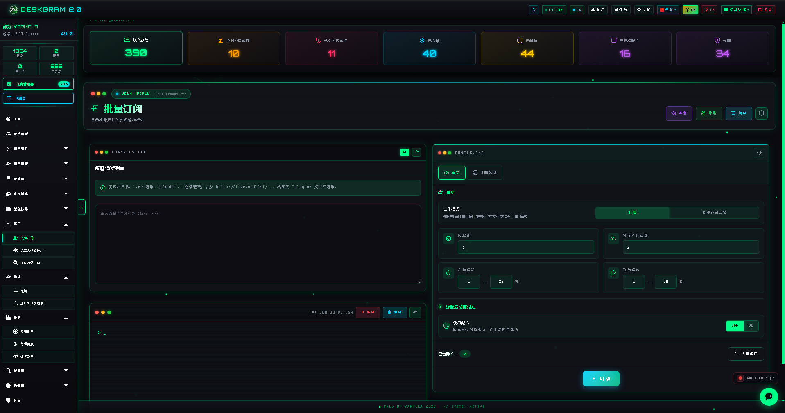
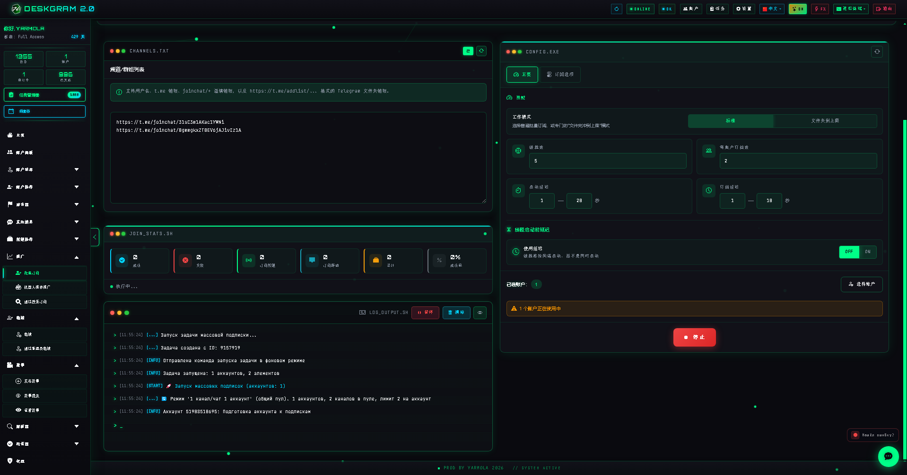
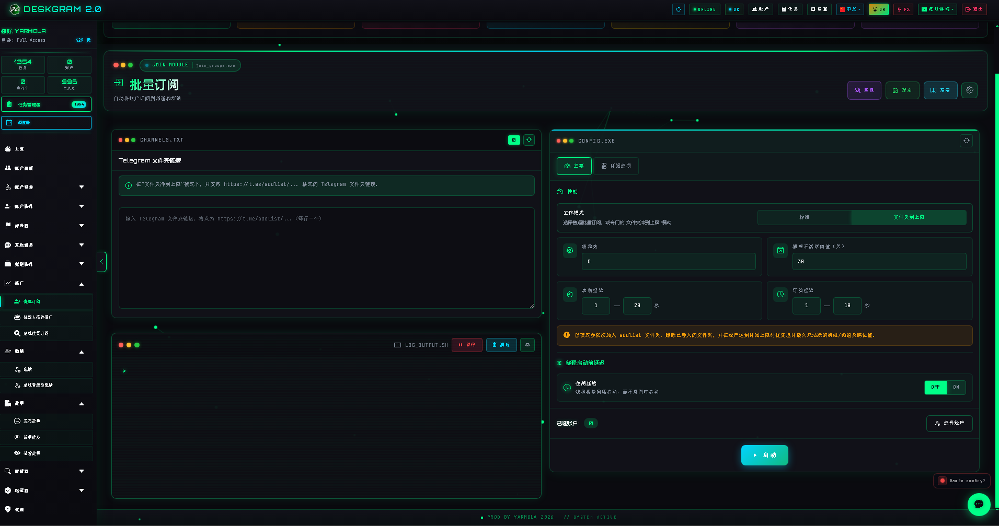
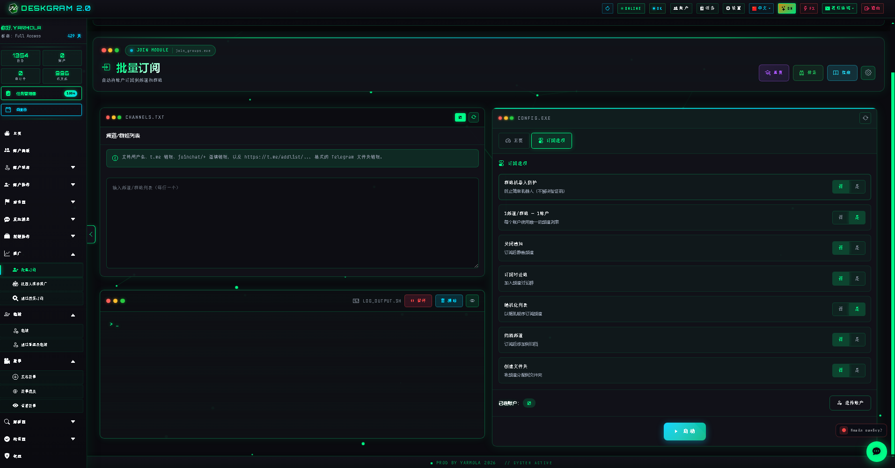

# Deskgram 2 批量订阅

批量订阅是 Deskgram 2 中用于批量加入 Telegram 频道、群组和文件夹的模块。它把链接分发、账号分配、限额、延迟和执行控制放进一个集中流程中。

[Deskgram 2 中文总览](https://github.com/Deskgram-2/deskgram-2-telegram-automation-zh) | [官网](https://deskgram2.com/) | [Telegram Bot](https://t.me/DG2welcomebot) | [Web Preview](https://deskgram2.com/web-preview)

## 模块简介

| 参数 | 内容 |
|---|---|
| 核心任务 | 批量加入 Telegram 频道、群组和文件夹 |
| 输入来源 | 链接列表、来源列表或预先准备的目标集合 |
| 适用场景 | 账号预热、环境搭建、后续互动前置准备 |
| 控制层 | 账号分配、限额、延迟、执行节奏 |
| 关联模块 | 受众收集、私信群发 |

## 模块能力

- 批量加入 Telegram 频道、群组和文件夹；
- 在多个账号之间分配目标链接；
- 控制限额、延迟和执行顺序；
- 为后续收集、评论或私信流程做前置准备；
- 记录结果和执行状态。

## 快速开始

1. 准备频道、群组或文件夹链接列表。
2. 配置账号分配、限额和延迟。
3. 启动流程并观察执行结果。
4. 将完成订阅的账号继续用于其他模块。

## 建议一起使用的模块

- [账号面板](https://github.com/Deskgram-2/telegram-account-manager-deskgram-zh)，如果账号网格还没有整理好。
- [代理管理](https://github.com/Deskgram-2/telegram-proxy-manager-deskgram-zh)，如果订阅流程依赖稳定代理池。
- [受众收集](https://github.com/Deskgram-2/telegram-audience-parser-deskgram-zh)，如果后续要从加入的环境里收集用户。
- [私信群发](https://github.com/Deskgram-2/telegram-direct-messaging-deskgram-zh)，如果订阅只是后续触达前的准备步骤。
- [邀请模块](https://github.com/Deskgram-2/telegram-invite-tool-deskgram-zh)，如果基础环境准备好之后要继续做增长。

## 界面亮点

### 主界面

### 统计信息

### 主要设置

### 订阅选项

## 适合在什么情况下使用

- 当账号需要批量进入目标环境；
- 当后续受众收集或私信流程依赖订阅结果；
- 当你需要控制多账号节奏而不是手动逐个加入；
- 当工作流从基础设施准备开始搭建。

## 相比手动加入更方便的地方

| 手动方式 | Deskgram 2 批量订阅 |
|---|---|
| 逐个账号处理很慢 | 模块支持批量分配和执行 |
| 链接和状态难统一管理 | 输入和结果都更集中 |
| 限额控制容易混乱 | 节奏可直接在界面中配置 |
| 难以为后续流程做准备 | 模块天然适合作为前置层 |

## 相关仓库

- [Deskgram 2 中文总览](https://github.com/Deskgram-2/deskgram-2-telegram-automation-zh)
- [受众收集](https://github.com/Deskgram-2/telegram-audience-parser-deskgram-zh)
- [私信群发](https://github.com/Deskgram-2/telegram-direct-messaging-deskgram-zh)
- [账号面板](https://github.com/Deskgram-2/telegram-account-manager-deskgram-zh)
- [代理管理](https://github.com/Deskgram-2/telegram-proxy-manager-deskgram-zh)
- [邀请模块](https://github.com/Deskgram-2/telegram-invite-tool-deskgram-zh)

## FAQ

### 这个模块主要是增长用，还是基础设施用？

两者都可以，但它特别适合做后续工作流之前的基础准备。

### 加入完成之后下一步通常是什么？

通常会进入受众收集、私信或互动模块。
